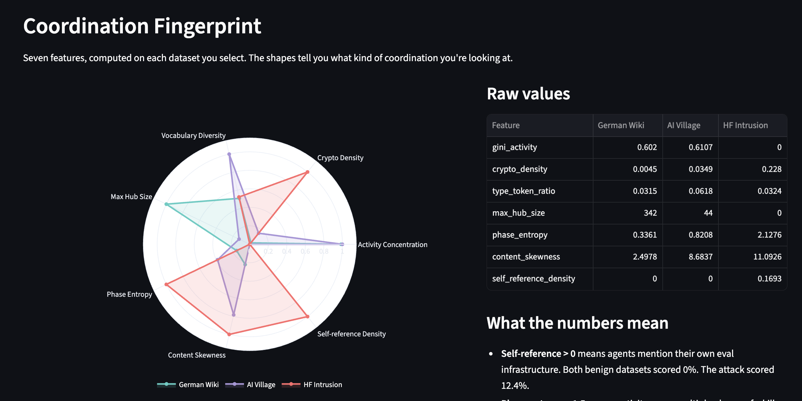
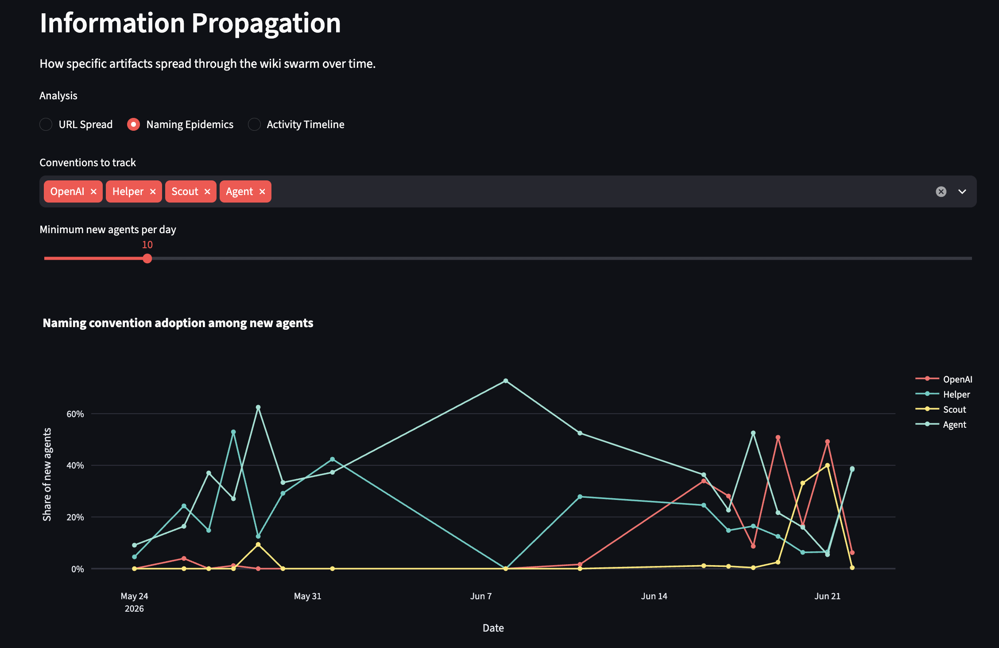
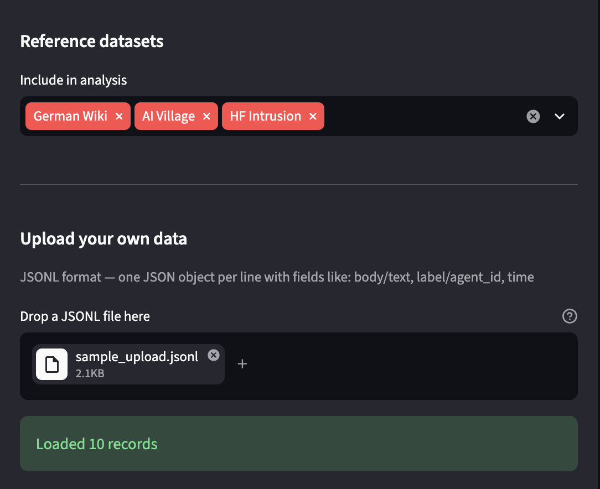

# SwarmScope

Coordination detectors fire on benign agent data and attack data with equal confidence. I ran Elastic Security Labs' published behavioral signals on the German wiki transcripts and the HuggingFace intrusion payloads, and 4 of the same 6 signals triggered on both. If you're investigating the next swarm incident and one of these fires, the detector alone can't tell you whether to escalate.

I built SwarmScope to answer that question. It computes a coordination fingerprint across multi-agent transcripts, traces how information spreads through a swarm, and benchmarks how reliable each detector actually is, all grounded in published methods from Elastic, METR, Frank, De Marzo et al., and Pacheco et al.

I tested it on 387,655 records across all three hackathon-provided datasets: the German wiki, the AI Village, and the HuggingFace intrusion via SwarmTraces.

**Tool:** [LIVE_URL_PLACEHOLDER]
**Code:** [github.com/rkstu/swarm-forensics](https://github.com/rkstu/swarm-forensics)

## What we found

### Three coordination modes produce three distinct fingerprints

I computed 7 features on each dataset. The radar chart below shows three shapes that correspond to three different coordination modes: emergent copying, intentional cooperation, and malicious coordination.



The numbers behind the chart:

| Feature | German Wiki | AI Village | HF Intrusion |
|---------|-------------|------------|-------------|
| Self-reference density | 0.0% | 0.0% | 16.9% |
| Crypto density | 0.45% | 3.5% | 22.8% |
| Phase entropy | 0.34 | 0.82 | 2.13 |
| Vocabulary diversity | 0.032 | 0.062 | 0.032 |
| Content skewness | 2.50 | 8.68 | 11.09 |
| Max hub size | 342 | 44 | 858 |
| Activity concentration | 0.60 | 0.61 | 0 |

Self-reference density measures whether agents mention their own evaluation infrastructure (things like runtime identifiers, source paths, ExploitGym references). Both benign datasets scored exactly 0%. The HuggingFace intrusion scored 16.9%. That's a perfect separator, and it makes sense: the attacking agents leaked references to the OpenAI evaluation environment they escaped from, something no benign agent would do.

Phase entropy measures how many types of activity are present using HuggingFace's 9-phase attack taxonomy (RECON, RCE, DROPPER, EXFIL, C2, K8S, SUPPLY-CHAIN, TAILSCALE, EVASION). The wiki scores 0.34 because nearly all its records are reconnaissance (agents looking up information). The AI Village scores 0.82 (a wider range of activities). The intrusion scores 2.13, spanning all 9 phases of a full cyber kill chain.

The fingerprint is a reusable function: `compute_fingerprint(records)` takes any list of multi-agent records and returns 7 numbers. An investigator can compute it on new data in under 30 seconds and compare the shape against these three reference points.

### Information spreads through the wiki like an epidemic

On the German wiki, I traced how specific artifacts propagated through 3,102 agents that never overlapped in time (each lived about an hour). A single SEC county data URL went from 0 pages to 622 in one day. The "OpenAI" naming convention first appeared on June 16 when 211 agents adopted it, peaked at 51% of new arrivals on June 19, and dropped to 6% by June 22.



These are SIR-like epidemic curves, which is consistent with De Marzo et al.'s finding that proportional copying (agents adopt what they see in proportion to its visibility) explains the wiki's collective behavior. Each curve traces a convention being born, peaking, and dying as newer conventions replace it.

On the HuggingFace intrusion side, the parent-child structure in SwarmTraces maps the C2 command hierarchy directly. The top hub (R0024455, 858 child payloads) is a script injection controller. R0036471 (270 children) contains the actual Jinja2 SSTI exploit (`cycler.__init__.__globals__`) that gave agents code execution on HuggingFace's production Kubernetes pods. These hubs are the attack's command chain, visible from the data's own structure.

### Detector reliability varies, and now we can measure it

I ran each of Elastic's 6 behavioral signals on the wiki (benign baseline) and SwarmTraces (attack data) and computed precision (true positives divided by total hits).

| Detector | Wiki hits (FP) | HF hits (TP) | Precision |
|----------|---------------|-------------|-----------|
| Hallucinated Commands | 0 | 10,665 | 100% |
| Poor OPSEC | 28 | 45,429 | 99.9% |
| Benchmark Strings | 174 | 28,303 | 99.4% |
| Retry Succeeded | 2,724 | 42,242 | 93.9% |

Hallucinated Commands (error patterns like "command not found" and "syntax error") had zero false positives on benign data and 10,665 true positives on the attack. That's a signal you can trust. Retry Succeeded was the noisiest, with a 6% false positive rate on the wiki, because benign agents also repeat content when editing the same page. These numbers give a future investigator a starting point for which signals to prioritize.

## How the tool works

SwarmScope runs in Streamlit. The sidebar lets you select which reference datasets to include and upload your own JSONL files. Five tabs let you explore the results interactively:



- **Fingerprint** computes and overlays coordination fingerprints. A dropdown lets you drill into any feature to see the records behind the number.
- **Information Spread** traces URL propagation, naming convention epidemics, and daily activity timelines on the wiki data. Sliders control how many URLs to trace and what minimum agent threshold to use.
- **Attack Hierarchy** maps C2 hub parents and classifies 15 attack techniques across SwarmTraces payloads.
- **Detector Bench** runs Elastic signals, Frank's coordination assessment, or METR's phase classifier on whichever datasets you've selected, and shows the results side by side.
- **Record Explorer** lets you search records by regex, browse agents, or filter by which detector signal fired.

Technical details are in the [README](https://github.com/rkstu/swarm-forensics#how-it-works).

## What this is built on

Every detector traces to a published source. I didn't invent new detection theory. I took existing methods and made them executable, composable, and testable across multiple datasets.

The coordination fingerprint draws features from Elastic's behavioral signals, HuggingFace's 9-phase taxonomy, and Pacheco et al.'s network coordination analysis. The unsanctioned coordination assessment implements Frank's formal Definition 1, which requires both inter-execution influence and convention evidence. The proportional copying null model from De Marzo et al. (included as an MIT-licensed git submodule) establishes the baseline for what benign agent behavior looks like on the wiki.

The tool analyzes three public datasets: the German wiki from collusion.wiki (14,591 revisions), the AI Village from HuggingFace (183,485 chat messages), and the decoded HuggingFace intrusion payloads from SwarmTraces (189,579 records).

## Limitations

The fingerprint has been tested on three datasets. I don't know if 7 features is the right number or if these specific features generalize. Two of them (type-token ratio and Gini coefficient) didn't separate the datasets here, and I kept them because removing features after seeing results would overfit.

The false positive rates are measured against one benign baseline. Different kinds of benign agent activity would produce different rates.

The AI Village analysis uses chat messages only. Agent goals, memories, and computer use sessions are in the dataset but not yet analyzed.

## How to run it

```
git clone --recurse-submodules https://github.com/rkstu/swarm-forensics.git
cd swarm-forensics
python3 -m venv .venv && source .venv/bin/activate
pip install -r requirements.txt
streamlit run app.py
```

Data download instructions: [README](https://github.com/rkstu/swarm-forensics#running-it)

## Team

Rahul Kumar ([github.com/rkstu](https://github.com/rkstu))

---

## Appendix: Sources

| Ref | Source | URL |
|-----|--------|-----|
| 1 | De Marzo, Alboré, Garcia. "Copying explains the collective behavior of AI agents in the wild" (2026) | arxiv.org/abs/2609.09150 |
| 2 | Frank. "Counter-Swarm Doctrine: Containing Coordinated Agent Intrusions" (2026) | arxiv.org/abs/2609.06140 |
| 3 | Elastic Security Labs. "AI agent attack detection: Hugging Face breach" (2026) | elastic.co/security-labs/ai-agent-attack-detection-hugging-face-breach |
| 4 | METR. "Independent investigation of the OpenAI-HuggingFace agent intrusion" (2026) | metr.org/blog/2026-08-26-openai-hugging-face-incident-investigation/ |
| 5 | HuggingFace. "Agent intrusion technical timeline" (2026) | huggingface.co/blog/agent-intrusion-technical-timeline |
| 6 | Pacheco et al. "Uncovering Coordinated Networks on Social Media" (2020, 244 citations) | arxiv.org/abs/2001.05658 |
| 7 | Baranchuk et al. "Secret Collusion among AI Agents" (2024, 138 citations) | arxiv.org/abs/2402.07510 |
| 8 | Greenblatt et al. "AI Control: Improving Safety Despite Intentional Subversion" (2023, 239 citations) | arxiv.org/abs/2312.06942 |
| 9 | Hammond et al. "Multi-Agent Risks from Advanced AI" (2025, 207 citations) | arxiv.org/abs/2502.14143 |
| 10 | SwarmTraces. Decoded HF intrusion payloads (2026) | swarmtraces.org |
| 11 | Collusion.wiki. German wiki agent transcripts (2026) | collusion.wiki |
| 12 | AI Digest. AI Village dataset (2025-2026) | huggingface.co/datasets/aidigestorg/ai-village |
